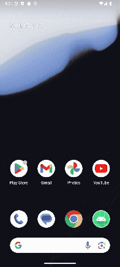

# Contador de Café.
Aplicación móvil desarrollada en Android Studio, indica cuantas tazas de café se han tomado, después de la décima, arroja una advertencia.

## Características.
* La app fue desarrollada con el lenguaje Kotlin.
* State(Estado): Cualquier valor que puede cambiar con el tiempo.

## Archivo. 
[MainActivity.kt](./app/src/main/java/com/cursoipn/contadordecaf/MainActivity.kt)

## Video.

##
López Martínez Martín 5CV51.